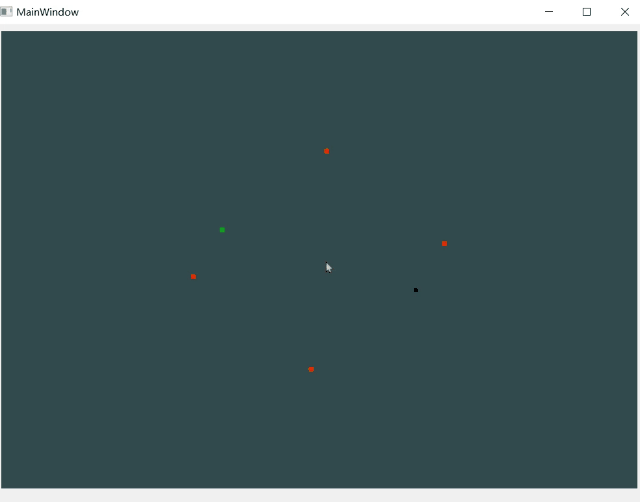

## 一个基于qt与opengl实现三维空间旋转的简单示例

### :incoming_envelope:编写环境

##### 程序使用集成软件**Qt Creator** 进行编译，其中**Qt**T版本为6.5.1，**Qt Creator**版本为10.0.2

### :notebook:注意事项

1. ##### 其中Fragment Shader(片段着色器)与Vertex Shader(顶点着色器)在项目中为ANSI格式的文本文件

2. ##### 使用时最好跟QT版本一致，不然可能存在一些库文件错误的问题

### :shower:程序介绍

##### 首先利用轨迹球将平面二维坐标转化为三维坐标，通过将变化前后的旋转轴，旋转角度为基础，最后形成一个4*4的旋转矩阵

### :tv:效果展示

